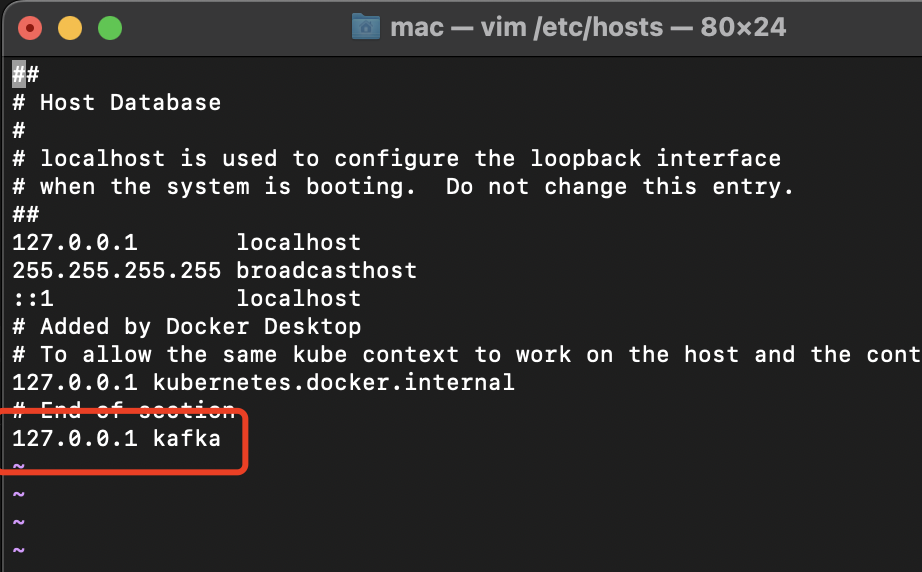
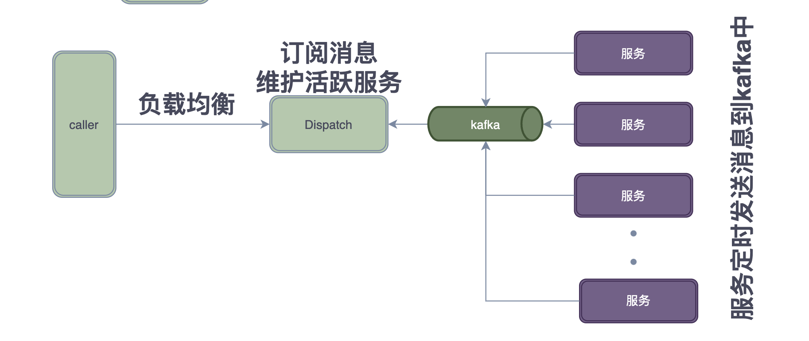
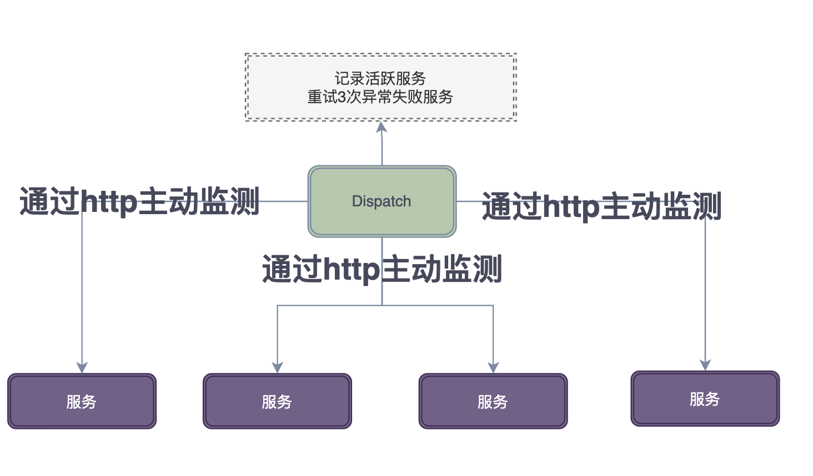

# 调度器关于负载均衡和保活设计

通过本项目可以学到什么？
- 负载均衡算法代码实现
- 调度器如何维护节点Live方案（参考）

## loadbalance

负载均衡算法：随机算法，轮询算法，加权轮询算法

> 随机算法
```go
// 随机
type Rand struct {
	addrs []string
}

func (r *Rand) Add(param []string) error {

	if len(param) != 1 {
		return ErrParam
	}
	r.addrs = append(r.addrs, param[0])
	return nil
}

// 随机种子，每次随机返回一个
func (r *Rand) Get() (string, error) {
	if len(r.addrs) == 0 {
		return "", ErrNoAddr
	}
	rand.Seed(time.Now().UnixNano())
	idx := rand.Intn(len(r.addrs))
	return r.addrs[idx], nil
}
```


> 轮询算法
```go
// 轮询
type RoundRobin struct {
	addrs []string

	curIdx int
}

func (r *RoundRobin) Add(param []string) error {
	if len(param) != 1 {
		return ErrParam
	}
	r.addrs = append(r.addrs, param[0])
	return nil
}

func (r *RoundRobin) Get() (string, error) {
	if len(r.addrs) == 0 || r.curIdx >= len(r.addrs) {
		return "", ErrNoAddr
	}
	addr := r.addrs[r.curIdx]
	r.curIdx = (r.curIdx + 1) % len(r.addrs) // 对curIdx每次+1
	return addr, nil
}

```

> 加权轮询算法

3.1 实现原理

对节点设置权重，权重越大被选中次数越高，节点被选中的次数≈(本节点权重/全部权重) * 总次数。

举例说明：

节点权重为:weight [a=1,b=2,c=5]

节点当前权重为curWeight：初始值为[a=0,b=0,c=0],变化规则为：curWeight + weight

全部权重sumWeight:  代表所有节点初始权重之和 1+2+5=8

第一次请求：

curWeight 为 [a=0+1,b=0+2,c=0+5] ，选中最大的c做为本次输出，之后c节点的权重需要减去sumWeight，调整后 [a=1,b=2,c=5-8]  也就是 [a=1,b=2,c=-3]

第二次请求：

curWeight 为  [a=1+1,b=2+2,c=-3+5]  结果为 [a=2,b=4,c=2]，选中最大的b作为本次输出，之后节点权重变更为 [a=2,b=-4,c=2]

第三次请求：

curWeight 为  [a=2+1,b=-4+2,c=2+5]  结果为 [a=3,b=-2,c=7]，又轮到c（权重大的好处体现出来了），之后节点权重变更为 [a=3,b=-2,c=-1]

第四次请求：

 [a=3,b=-2,c=-1] 加权后[a=4,b=0,c=4]，a与c相等，优先选前者输出a

```go
type WeigthRoundRobin struct {
	weightAddrs []*weightAddr
}

type weightAddr struct {
	addr      string // 地址
	weight    int    // 权重
	curWeight int    // 计算使用
}

func (w *WeigthRoundRobin) Add(param []string) error {
	if len(param) != 2 {
		return ErrParam
	}

	weight, err := strconv.Atoi(param[1])
	if err != nil {
		return err
	}
	w.weightAddrs = append(w.weightAddrs, &weightAddr{
		addr:      param[0],
		weight:    weight,
		curWeight: 0,
	})

	return nil
}

func (w *WeigthRoundRobin) Get() (string, error) {

	if len(w.weightAddrs) == 0 {
		return "", ErrNoAddr
	}

	maxWeight := math.MinInt
	idx := 0
	sumWeight := 0 // 权重总和
	for k, weightAddr := range w.weightAddrs {

		sumWeight += weightAddr.weight // 权重总和

		weightAddr.curWeight += weightAddr.weight // 加上权重
		if weightAddr.curWeight > maxWeight {     // 记录最大值
			maxWeight = weightAddr.curWeight
			idx = k
		}
	}

	w.weightAddrs[idx].curWeight -= sumWeight // 减去权重总和
	return w.weightAddrs[idx].addr, nil       // 返回最大权重的结果
}

```


## 有效服务维护方案（参考）
### 方案一：heart【心跳】

前置配置：
1.启动docker
```sh
docker-compose -f docker-compose-env.yml   up -d zookeeper
docker-compose -f docker-compose-env.yml   up -d kafka
```
2.修改本地hosts
`vim /etc/hosts`增加 `127.0.0.1 kafka`

3.kafka常用脚本【可选】 [进入docker中*.sh位于 /opt/kafka/bin目录]
```sh
# 创建topic
./kafka-topics.sh --create --zookeeper zookeeper:2181 --replication-factor 1 --partitions 3 --topic easy_topic
# 列出所有topic
./kafka-topics.sh --list --zookeeper zookeeper:2181
# 从头开始消费
./kafka-console-consumer.sh --bootstrap-server kafka:9092 --from-beginning --topic easy_topic
# 消费组【从最新的消息消费】
./kafka-console-consumer.sh --bootstrap-server kafka:9092 --consumer-property group.id=testGroup --topic easy_topic
# 从最新开始消费
./kafka-console-consumer.sh --bootstrap-server kafka:9092 --topic easy_topic
# 生产消息
./kafka-console-producer.sh --broker-list kafka:9092 --topic easy_topic
```

调度器订阅kafka消息，同时维护一个**有效服务**，然后按照负载均衡策略分发请求。



```go
func main() {

	// 服务负责发送心跳
	go heart.RunHeartBeat()
	// 调度器负责接收心跳
	go heart.ListenHeartbeat()

	// 利用负载均衡获取

	lb := loadbalance.LoadBalanceFactory(loadbalance.BalanceTypeRand)
	go func() {
		for {
			time.Sleep(5 * time.Second)
			for _, v := range heart.GetAddrList() {
				lb.Add([]string{v})
			}
			fmt.Println(lb.Get())
		}

	}()

	sigusr1 := make(chan os.Signal, 1)
	signal.Notify(sigusr1, syscall.SIGTERM)
	<-sigusr1
}
```

### 方案二：health【健康检查】

通过HTTP请求服务，维护活跃节点



```go
func main() {
	health.AddAddr("https://www.sina.com.cn/", "https://www.baidu.com/", "http://www.aajklsdfjklsd")
	go health.HealthCheck()

	time.Sleep(50 * time.Second)

	alist := health.GetAliveAddrList()
	for i := 0; i < len(alist); i++ {
		fmt.Println(alist[i])
	}

	var block = make(chan bool)
	<-block
}


```